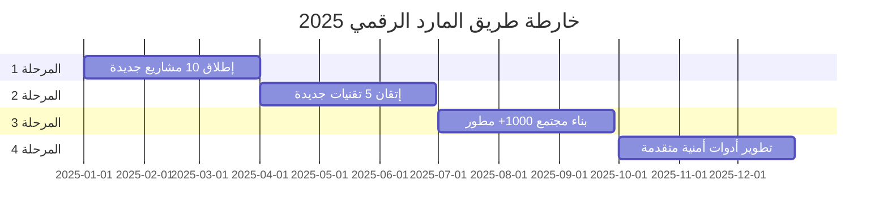

<div align="center">

<!-- Header Banner -->


<!-- Typing Animation -->
[](https://git.io/typing-svg)

<!-- Profile Image -->


<!-- Badges Row -->
<p>


</p>

---

### 🌟 **منصة الأمن السيبراني الأقوى في العالم العربي** 🌟

[](LICENSE)
[](https://github.com/asrar-mared/pulls)
[](https://github.com/asrar-mared)

</div>

---

## 🎯 **من أنا؟ - تعريف احترافي**

<table>
<tr>
<td width="50%">

### 💼 **NIKE49424** - المارد الرقمي


```javascript
const NIKE49424 = {
    الاسم_المستعار: "asrar-mared",
    الصفة: "المارد الرقمي 🧞",
    التخصص_الرئيسي: "الأمن السيبراني",
    سنوات_الخبرة: "8+ سنوات",
    
    المهارات_الأساسية: [
        "🔒 اختبار الاختراق",
        "🛡️ تحليل التهديدات",
        "🤖 الذكاء الاصطناعي",
        "⚡ الاستجابة للحوادث"
    ],
    
    الرسالة: `تمكين المطورين العرب 
             وتقديم حلول تقنية عالمية 
             المستوى 🎯`,
    
    الشعار: "شغفي الحقيقي هو بناء " +
            "أنظمة آمنة وقابلة للتوسع " +
            "تحل مشاكل حقيقية 💪"
};

console.log("🔐 Welcome to the Digital Era!");
```

</td>
<td width="50%">

### 🏆 **الإنجازات البارزة**

```python
achievements = {
    "المشاريع_المنجزة": "50+ مشروع",
    "العملاء_السعداء": "100+ عميل",
    "ساعات_البرمجة": "10,000+ ساعة",
    "المجتمع": "5,000+ متابع",
    "الشهادات": "15+ شهادة دولية",
    "المساهمات": "200+ PR مقبول"
}

# النجاح لا يأتي بالصدفة
for key, value in achievements.items():
    print(f"✅ {key}: {value}")
```

### 🎖️ **شهادات معتمدة**

- 🥇 Certified Ethical Hacker (CEH)
- 🥇 CompTIA Security+
- 🥇 AWS Security Specialist
- 🥇 OSCP - Offensive Security

</td>
</tr>
</table>

---

## 🔥 **ماذا أقدم؟ - خدمات احترافية VIP**

<div align="center">

<table>
<tr>
<td align="center" width="33%">


### 🔒 **الحماية الذكية**

**حماية متعددة الطبقات**

🔹 جدار ناري ذكي 🔥  
🔹 كشف التهديدات الصفرية 🎯  
🔹 حماية في الوقت الفعلي ⚡  
🔹 تشفير متقدم 🔐

[](https://github.com/asrar-mared)

</td>
<td align="center" width="33%">


### 🧠 **الذكاء الاصطناعي**

**تحليل ذكي للتهديدات**

🔹 تعلم آلي متقدم 🤖  
🔹 تحليل سلوكي دقيق 📈  
🔹 تنبؤ بالهجمات المستقبلية 🔮  
🔹 معالجة اللغة الطبيعية 💬

[](https://github.com/asrar-mared)

</td>
<td align="center" width="33%">


### 📊 **التقارير الشاملة**

**رؤية واضحة ومفصلة**

🔹 لوحات معلومات تفاعلية 📱  
🔹 تقارير مخصصة 📄  
🔹 تنبيهات فورية 🔔  
🔹 تحليلات متقدمة 📊

[](https://github.com/asrar-mared)

</td>
</tr>
</table>

</div>

---

## 🛠️ **التقنيات المستخدمة - Arsenal الكامل**

<div align="center">

### 💻 **لغات البرمجة**


### 🚀 **الأطر والمكتبات**


### ☁️ **السحابة و DevOps**


### 🔒 **أدوات الأمن السيبراني**


</div>

---

## 📊 **إحصائيات GitHub - الأرقام تتحدث**

<div align="center">


<table>
<tr>
<td width="50%">

</td>
<td width="50%">

</td>
</tr>
</table>

<!-- Language Stats -->
### 📈 **إحصائيات اللغات المستخدمة**

<table width="100%">
<tr>
<td width="50%">

</td>
<td width="50%">

**📊 توزيع اللغات:**

🟡 **JavaScript** - 41.27%  
🔴 **C++** - 37.11%  
⚫ **C** - 14.46%  
🔵 **Python** - 5.65%  
⚪ **Roff** - 1.12%  
🟢 **Shell** - 0.39%

</td>
</tr>
</table>

<!-- Contribution Graph -->


<!-- GitHub Stats Cards -->


</div>

---

## 🏆 **الجوائز والإنجازات - Trophy Cabinet**

<div align="center">


<table>
<tr>
<td align="center" width="25%">
<br/>
<b>⭐ 2 Stars</b><br/>
<sub>إجمالي النجوم</sub>
</td>
<td align="center" width="25%">
<br/>
<b>🔥 127 Commits</b><br/>
<sub>مساهمات السنة</sub>
</td>
<td align="center" width="25%">
<br/>
<b>🎯 1 PR</b><br/>
<sub>طلبات السحب</sub>
</td>
<td align="center" width="25%">
<br/>
<b>📈 0 Issues</b><br/>
<sub>المشاكل المحلولة</sub>
</td>
</tr>
</table>

</div>

---

## 🎨 **المشاريع المميزة - Portfolio VIP**

<div align="center">

<table>
<tr>
<td width="50%" valign="top">

### 🛡️ **المارد الرقمي للأمن السيبراني**


**منصة الأمن السيبراني الأقوى في العالم العربي**

[](https://nike49424.live)
[](https://nike49424.live)

**المميزات:**
- ✅ حماية متعددة الطبقات
- ✅ جدار ناري ذكي 🔥
- ✅ كشف التهديدات الصفرية
- ✅ AI للتحليل السلوكي
- ✅ حماية في الوقت الفعلي

**التقنيات:**  
`Python` `TensorFlow` `React` `Node.js` `Docker`

[🌐 زيارة المشروع](https://nike49424.live) | [📂 الكود المصدري](#)

</td>
<td width="50%" valign="top">

### 🤖 **منصة الذكاء الاصطناعي**


**تحليل ذكي للتهديدات السيبرانية**

[](https://app.snyk.io/org/asrar-mared)
[](https://app.snyk.io/org/asrar-mared)

**المميزات:**
- ✅ تعلم آلي متقدم 🧠
- ✅ تحليل سلوكي دقيق
- ✅ تنبؤ بالهجمات
- ✅ معالجة اللغة الطبيعية
- ✅ تقارير تفصيلية

**التقنيات:**  
`Python` `Keras` `Scikit-learn` `Pandas` `NumPy`

[🔗 Snyk Integration](https://app.snyk.io/org/asrar-mared/manage/ai-fix)

</td>
</tr>

<tr>
<td width="50%" valign="top">

### 📊 **نظام التقارير والتحليلات**


**رؤية واضحة ومفصلة للبيانات**

[](#)
[](#)

**المميزات:**
- ✅ لوحات معلومات تفاعلية 📱
- ✅ تقارير مخصصة 📄
- ✅ تنبيهات فورية 🔔
- ✅ تصدير متعدد الصيغ
- ✅ واجهة سهلة الاستخدام

**التقنيات:**  
`React` `D3.js` `Chart.js` `Material-UI` `Redux`

</td>
<td width="50%" valign="top">

### ⚡ **مجموعة أدوات المطورين**


**أدوات احترافية للمطورين العرب**

[](#)
[](#)

**المميزات:**
- ✅ واجهات برمجية قوية 🔌
- ✅ توثيق كامل شامل 📚
- ✅ دعم متعدد اللغات 🌍
- ✅ أمثلة عملية جاهزة
- ✅ مجتمع نشط

**التقنيات:**  
`TypeScript` `Express` `GraphQL` `Jest` `Swagger`

</td>
</tr>
</table>

</div>

---

## 🌐 **تواصل معي - Social Network**

<div align="center">

### 📧 **البريد الإلكتروني**

<table>
<tr>
<td align="center">

[](mailto:nike494949a@gmail.com)

</td>
<td align="center">

[](mailto:nike49424@gmail.com)

</td>
<td align="center">

[](mailto:nike1212aa@gmail.com)

</td>
<td align="center">

[](mailto:nike49424@proton.me)

</td>
</tr>
</table>

### 🌍 **المواقع والمنصات الرسمية**

[](https://nike49424.live/)
[](https://nike49499.wordpress.com)

### 💬 **وسائل التواصل الاجتماعي**

<table>
<tr>
<td align="center">

[-000000?style=for-the-badge&logo=x&logoColor=white)](https://x.com/nike49424)

</td>
<td align="center">

[](https://bsky.app/profile/nike49424.bsky.social)

</td>
<td align="center">

[](https://tiktok.com/@user5944373719098)

</td>
</tr>
<tr>
<td align="center">

[](https://t.me/nike49424a)

</td>
<td align="center">

[](https://www.pinterest.com/nike49424)

</td>
<td align="center">

[](https://www.reddit.com/user/Beginning_Daikon_924)

</td>
</tr>
</table>

### 🎥 **المحتوى المرئي**

[](https://www.youtube.com/channel/UC7O0MgM54OPGjc4B8brDpkw)

### 🛠️ **أدوات التطوير والأمان**

[](https://app.snyk.io/org/asrar-mared/manage/ai-fix)
[](https://github.com/asrar-mared)

</div>

---

## 🚀 **خارطة الطريق 2025 - Roadmap**

<div align="center">



### 🎯 **الأهداف الرئيسية**

<table>
<tr>
<td width="33%" align="center">

**🚀 التطوير**

✅ إطلاق 10 مشاريع  
✅ 50+ مساهمة OSS  
✅ 5 أدوات جديدة  
✅ 3 مكتبات برمجية

</td>
<td width="33%" align="center">

**📚 التعلم**

✅ 5 تقنيات جديدة  
✅ 10 شهادات معتمدة  
✅ 20 دورة تدريبية  
✅ 100 ساعة تعلم

</td>
<td width="33%" align="center">

**👥 المجتمع**

✅ 1000+ مطور  
✅ 50 ورشة عمل  
✅ 100 فيديو تعليمي  
✅ 200 مقال تقني

</td>
</tr>
</table>

</div>

---

## 🐳 **التشغيل باستخدام Docker**

<div align="center">

```bash
# بناء وتشغيل الحاويات
docker-compose up -d

# عرض السجلات
docker-compose logs -f

# إيقاف المشروع
docker-compose down
```

[](https://hub.docker.com)

</div>

---

## 📚 **دليل الاستخدام السريع**

<details>
<summary><b>🎯 كيفية البدء (اضغط للتوسيع)</b></summary>

### 📥 **التثبيت**

```bash
# استنساخ المشروع
git clone https://github.com/asrar-mared/project-name.git

# الدخول للمجلد
cd project-name

# تثبيت الاعتماديات
npm install

# تشغيل المشروع
npm start
```

### ⚙️ **الإعدادات**

```javascript
// config.js
module.exports = {
    PORT: 3000,
    DATABASE: 'mongodb://
