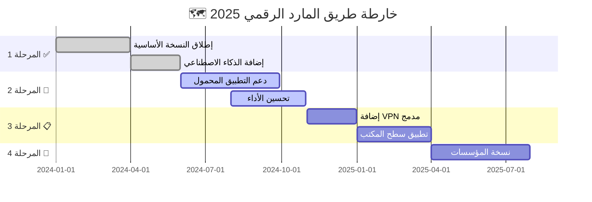

<div align="center">

# 🧞‍♂️ أسرار المارد الرقمي للأمن السيبراني 🛡️


### 🌟 منصة الأمن السيبراني الأقوى في العالم العربي 🌟

[](https://github.com/nike1212a/Digital-warrior-secrets/releases)
[](LICENSE)
[](https://github.com/nike1212a/Digital-warrior-secrets)
[](https://github.com/nike1212a/Digital-warrior-secrets/stargazers)


</div>

---

## 🧞 ما هو المارد الرقمي؟

<table>
<tr>
<td width="50%">

### 🎯 الرؤية
**المارد الرقمي** هو نظام أمن سيبراني متكامل مصمم خصيصاً للمستخدمين العرب، يجمع بين قوة التكنولوجيا الحديثة وسهولة الاستخدام.

### 💎 المميزات الفريدة
- 🔐 **حماية متعددة الطبقات**
- 🚀 **سرعة فائقة في الكشف**
- 🧠 **ذكاء اصطناعي متقدم**
- 🌍 **دعم كامل للغة العربية**

</td>
<td width="50%">

```ascii
    🧞‍♂️
   /|\  المارد الرقمي
  / | \  يحميك من:
 /  |  \ 
    |    ⚡ الهجمات السيبرانية
   / \   🦠 البرمجيات الخبيثة
  /   \  🎣 التصيد الاحتيالي
         🔓 الاختراقات
```

</td>
</tr>
</table>

---

## 🎨 معرض الصور والواجهات

<div align="center">

### 📸 لقطات من المشروع

<table>
  <tr>
    <td></td>
    <td></td>
    <td></td>
  </tr>
  <tr>
    <td align="center">🎛️ <b>لوحة التحكم الذكية</b></td>
    <td align="center">📊 <b>تقارير تفصيلية</b></td>
    <td align="center">⚡ <b>حماية فورية</b></td>
  </tr>
</table>


</div>

---

## 🚀 المميزات الرئيسية

<table>
<tr>
<td width="33%" align="center">

### 🔒 الحماية الذكية


**حماية متعددة الطبقات**
- جدار ناري ذكي 🔥
- كشف التهديدات الصفرية 🎯
- حماية في الوقت الفعلي ⚡

</td>
<td width="33%" align="center">

### 🧠 الذكاء الاصطناعي


**تحليل ذكي للتهديدات**
- تعلم آلي متقدم 🤖
- تحليل سلوكي دقيق 📈
- تنبؤ بالهجمات المستقبلية 🔮

</td>
<td width="33%" align="center">

### 📊 التقارير الشاملة


**رؤية واضحة ومفصلة**
- لوحات معلومات تفاعلية 📱
- تقارير مخصصة 📄
- تنبيهات فورية 🔔

</td>
</tr>
</table>

---

## 🛠️ التقنيات المستخدمة

<div align="center">

<table>
<tr>
<td align="center" width="96">

<br>Python
</td>
<td align="center" width="96">

<br>JavaScript
</td>
<td align="center" width="96">

<br>React
</td>
<td align="center" width="96">

<br>Node.js
</td>
<td align="center" width="96">

<br>Docker
</td>
<td align="center" width="96">

<br>MongoDB
</td>
</tr>
<tr>
<td align="center" width="96">

<br>Redis
</td>
<td align="center" width="96">

<br>GitHub
</td>
<td align="center" width="96">

<br>AWS
</td>
<td align="center" width="96">

<br>TensorFlow
</td>
<td align="center" width="96">

<br>Kubernetes
</td>
<td align="center" width="96">

<br>Linux
</td>
</tr>
</table>

</div>

---

## 📥 التثبيت والإعداد

### 🎯 المتطلبات الأساسية

```bash
# تأكد من تثبيت:
- Node.js v18+ 🟢
- Python 3.11+ 🐍
- Docker 🐳
- Git 📦
```

### 🚀 البدء السريع

```bash
# 1️⃣ استنساخ المشروع
git clone https://github.com/nike1212a/Digital-warrior-secrets.git
cd Digital-warrior-secrets

# 2️⃣ تثبيت التبعيات
npm install
pip install -r requirements.txt

# 3️⃣ إعداد البيئة
cp .env.example .env
# قم بتحرير ملف .env وإضافة المفاتيح الخاصة بك

# 4️⃣ تشغيل المشروع
npm run dev

# 🎉 الآن افتح المتصفح على: http://localhost:3000
```

### 🐳 التشغيل باستخدام Docker

```bash
# بناء وتشغيل الحاويات
docker-compose up -d

# عرض السجلات
docker-compose logs -f

# إيقاف المشروع
docker-compose down
```

---

## 📖 دليل الاستخدام

<details>
<summary>🎯 <b>كيفية البدء (اضغط للتوسيع)</b></summary>

### الخطوة 1️⃣: إنشاء حساب جديد
```javascript
// مثال على التسجيل
const user = await digitalMared.register({
  username: 'اسم_المستخدم',
  email: 'email@example.com',
  password: 'كلمة_مرور_قوية'
});
```

### الخطوة 2️⃣: تفعيل الحماية
```javascript
// تفعيل جميع أنظمة الحماية
await digitalMared.enableProtection({
  firewall: true,
  antiVirus: true,
  intrusionDetection: true
});
```

### الخطوة 3️⃣: مراقبة النظام
```javascript
// الحصول على تقرير الأمان
const report = await digitalMared.getSecurityReport();
console.log(report);
```

</details>

<details>
<summary>🔐 <b>الميزات المتقدمة</b></summary>

### الكشف عن التهديدات
```python
# مثال Python للكشف عن التهديدات
from digital_mared import ThreatDetector

detector = ThreatDetector()
threats = detector.scan_system()

for threat in threats:
    print(f"🚨 تهديد مكتشف: {threat.name}")
    print(f"📊 مستوى الخطورة: {threat.severity}")
```

### الحماية التلقائية
```python
# تفعيل الحماية الآلية
detector.enable_auto_protect(
    real_time=True,
    ai_powered=True,
    notifications=True
)
```

</details>

---

## 🎯 خارطة الطريق

<div align="center">



</div>

---

## 📊 إحصائيات المشروع

<div align="center">


### 🏆 المساهمون الرائعون

<a href="https://github.com/nike1212a/Digital-warrior-secrets/graphs/contributors">
  
</a>

</div>

---

## 🤝 المساهمة في المشروع

نرحب بمساهماتكم! 💚

<table>
<tr>
<td>

### 📝 كيف تساهم؟

1. 🍴 Fork المشروع
2. 🌿 إنشاء فرع جديد (`git checkout -b feature/amazing`)
3. ✍️ Commit التغييرات (`git commit -m '✨ إضافة ميزة رائعة'`)
4. 📤 Push للفرع (`git push origin feature/amazing`)
5. 🎉 فتح Pull Request

</td>
<td>

### 📜 معايير المساهمة

- ✅ كود نظيف ومنظم
- 📚 توثيق شامل
- 🧪 اختبارات شاملة
- 🌐 دعم اللغة العربية
- 🎨 التزام بدليل الأسلوب

</td>
</tr>
</table>

---

## 🐛 الإبلاغ عن المشاكل

وجدت مشكلة؟ لا تقلق! 

<div align="center">

[](https://github.com/nike1212a/Digital-warrior-secrets/issues/new)

</div>

### 🔍 نموذج الإبلاغ

```markdown
### 🐛 وصف المشكلة
وصف واضح ومختصر للمشكلة

### 📝 خطوات إعادة الإنتاج
1. اذهب إلى '...'
2. اضغط على '....'
3. انتظر حتى '....'
4. ظهور الخطأ

### 🎯 السلوك المتوقع
ماذا توقعت أن يحدث

### 📸 لقطات الشاشة
إن وجدت

### 💻 البيئة
- نظام التشغيل: [مثال: Windows 11]
- المتصفح: [مثال: Chrome 120]
- النسخة: [مثال: v2.5.0]
```

---

## 📞 التواصل والدعم

<div align="center">

### 🌐 تابعنا على وسائل التواصل

[](https://discord.gg/digital-mared)
[](https://t.me/digital_mared)
[](https://twitter.com/digital_mared)
[](https://linkedin.com/company/digital-mared)
[](https://youtube.com/@digital_mared)

### 📧 البريد الإلكتروني
**support@digital-mared.com**

</div>

---

## 📄 الترخيص

<div align="center">

هذا المشروع مرخص تحت [رخصة MIT](LICENSE)

```
MIT License

Copyright (c) 2025 المارد الرقمي

يُسمح بحرية استخدام ونسخ وتعديل وتوزيع البرنامج
مع الاحتفاظ بإشعار حقوق النشر والترخيص.
```

</div>

---

## 🙏 شكر وتقدير

<div align="center">

### 💙 شكراً لكل من ساهم في هذا المشروع

<table>
<tr>
<td align="center">
<br />
<sub><b>المطور الرئيسي</b></sub>
</td>
<td align="center">
<br />
<sub><b>مطور الأمان</b></sub>
</td>
<td align="center">
<br />
<sub><b>مصمم UI/UX</b></sub>
</td>
<td align="center">
<br />
<sub><b>خبير الذكاء الاصطناعي</b></sub>
</td>
</tr>
</table>

### 🌟 شكر خاص

- جميع المساهمين في المشروع 🙌
- المجتمع العربي للأمن السيبراني 🛡️
- مستخدمينا الرائعين حول العالم 🌍

</div>

---

<div align="center">

### 🧞‍♂️ المارد الرقمي يحميك دائماً 🛡️


**صُنع بـ 💜 في العالم العربي**

[](https://github.com/nike1212a/Digital-warrior-secrets/stargazers)
[](https://github.com/nike1212a)

<sub>آخر تحديث: 2025 © جميع الحقوق محفوظة</sub>

</div>
